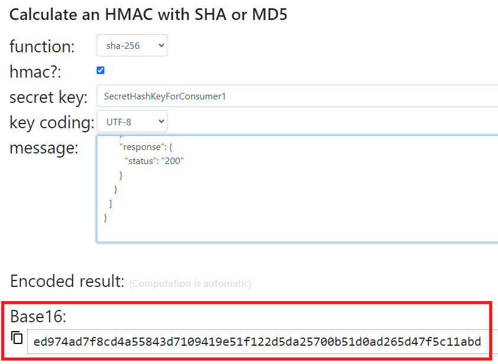

## 1 - Setting up the service locally:

### 1.1 - Pre-requisites
- Java11
- Maven
- athenahealth developer portal preview client ID and secret

### 1.2 - Starting the service

Edit `src/main/resources/application.yaml` and update the `clientId` and `clientSecret` placeholders with your preview client ID and secret.

Run the partner-service in your favorite IDE with the below environment variables:
```
SPRING_PROFILES_ACTIVE=local
```

Navigate to http://localhost:8888/swagger-ui/index.html

### 1.3 - Testing the service

Test webhook endpoint using the provided shell scripts:

```
./send-appointment-notification.sh
./send-patient-notification.sh
./send-order-notification.sh
```

Note: if you want to adjust the example notification payload provided in the above script, you will also need to update the X-Hub-Signature accordingly.  *Whitespace matters here, including trailing whitespace.*  To calculate the expected HMAC signature you can use an online calculator such as https://dinochiesa.github.io/hmachash/index.html.  For example:


